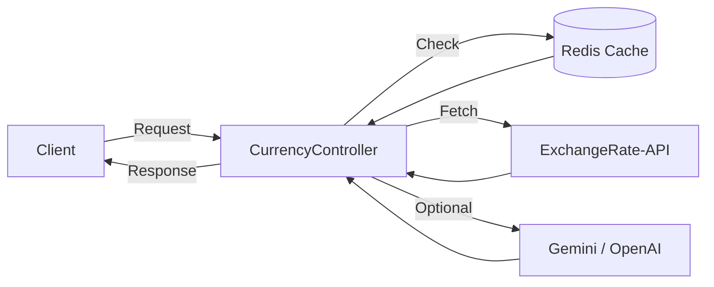

# NusaFx Currency Conversion Service

## 📖 Overview
NusaFx is a .NET 8 Web API service that provides currency conversion functionality.
It integrates **ExchangeRate‑API** for live rates, **Redis** for caching, and optionally compares results with **AI providers** (OpenAI or Google Gemini) to highlight differences between authoritative financial data and AI‑generated estimates.

---

## ⚙️ Approach

### 🔹 [Live Rate Integration](ca://s?q=ExchangeRate_API)
- Uses ExchangeRate‑API as the authoritative source for conversion rates.
- Responses are cached in Redis for 1 hour to reduce API calls and improve performance.
- Ensures consistent, reliable, and up‑to‑date currency data.

### 🔹 [Caching with Redis](ca://s?q=dotnet_Redis_cache)
- Rates stored under normalized keys (`rate:USD:MYR`).
- Redis provides persistence across app restarts and supports distributed scaling.
- If Redis is unavailable, the service returns a **Failure** result to ensure transparency.

### 🔹 [Error Handling](ca://s?q=dotnet_error_handling)
Robust error handling for:
- API downtime or error responses.
- Invalid currency codes (e.g., `XYZ`).
- Redis unavailability (treated as a hard failure).

### 🔹 [AI Comparison](ca://s?q=AI_currency_rate_comparison)
- Optional endpoint (`/convert-with-ai`) calls Gemini or OpenAI to request an AI‑generated exchange rate.
- Compares the AI rate with the live rate, calculates the difference, and returns both.
- Demonstrates the gap between **real‑time financial APIs** and **AI estimates**, educating users about when AI is suitable (explanations, trends) versus when live APIs are required (transactions).

---

## 📄 Why This Approach
- **Reliability**: Live API + Redis caching ensures accurate and performant conversions.
- **Transparency**: Error handling makes failures explicit instead of silent.
- **Educational Value**: AI comparison highlights the limitations of LLMs in financial contexts.
- **Scalability**: Redis enables distributed caching, making the service production‑ready.

---

## 🚀 Endpoints
- `GET /convert` → Convert currency using live API + Redis cache.
- `GET /convert-with-ai` → Convert currency and compare live rate with AI‑generated rate.

---

## 🏗️ Architecture Diagram

## Project Structure
src/
├── NusaFx.WebApi/                # Presentation Layer (ASP.NET Core Web API)
│   ├── Controllers/              # API endpoints (CurrencyController, etc.)
│   ├── Properties/               # Assembly info
│   ├── Program.cs                # Startup and service registration
│   ├── appsettings.json          # Configuration (API keys, Redis, etc.)
│   ├── appsettings.Development.json
│
├── NusaFx.Application/           # Application Layer (business logic, orchestration)
│   ├── Common/                   # Shared utilities
│   │   └── Models/               # DTOs, Result<T>, PagedResult, Currency, etc.
│   ├── Entities/                 # Application-specific entities
│   ├── Interfaces/               # Abstractions (ICurrencyService, ICacheService, etc.)
│   ├── Middleware/               # Cross-cutting concerns (logging, exception handling)
│   └── Services/                 # Core services (CurrencyService, AiRateService, TransactionService)
│
├── NusaFx.Infrastructure/        # Infrastructure Layer (external concerns)
│   ├── Persistence/              # EF Core DbContext, Configurations, Scripts
│   ├── Repositories/             # Repository implementations

│
├── NusaFx.sln                    # Solution file
├── README.md                     # Documentation
├── .gitignore
└── global.json

